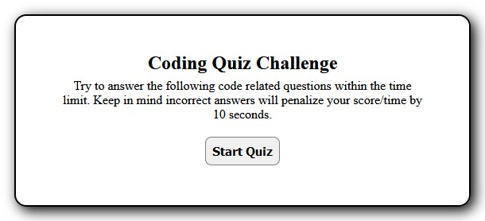
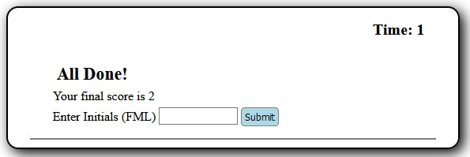

# JavaScript Code Quiz
  

This is my solution to a JavaScript Code Quiz Challenge. You can view the [live demo](https://yooperjb.github.io/code-quiz/) or [download the code](https://github.com/yooperjb/code-quiz) to edit or run. 

## Project Status 10/20
Everything works but I plan to clean up the layout of the quiz and refactor the code to make it easier to read. 

## Challenge Description
The challenge was to use JavaScript to create a timed quiz that keeps score as the user progresses. If a correct answer is given then the score increases, with an incorrect answer the time is decreased by ten seconds. After each question, there is dynamic text that displays whether your answer was correct or incorrect.

When either the time expires or the questions are completed the quiz stops, the final score is shown, and an input text box for entering initials appears. When submitting initials, it checks for three characters and alerts user if less or more than three characters is entered. When successful the user is taken to a high scores page showing scores stored in the browers localStorage. 

## Challenge Approach
I used JavaScript, HTML, and CSS for the challenge. The quiz consits of two HTML pages, the entrance page and the interactive quiz page. During the quiz process, the page elements are altered using the DOM, rather than new HTML pages. 

## Viewing the Quiz
The easiest way to see the challenge solution is to view the [live demo](https://yooperjb.github.io/code-quiz/) on GitHub Pages. You can also view, clone, and download the [project repository](https://github.com/yooperjb/code-quiz) via GitHub. 

## Resources
Any resources that I may have used will be listed here.

### Images
* [Quiz Intro](./assets/images/quiz_start.jpg)
* [Quiz Body](./assets/images/quiz_questions.jpg)
* [Quiz Complete](./assets/images/quiz_complete.jpg)